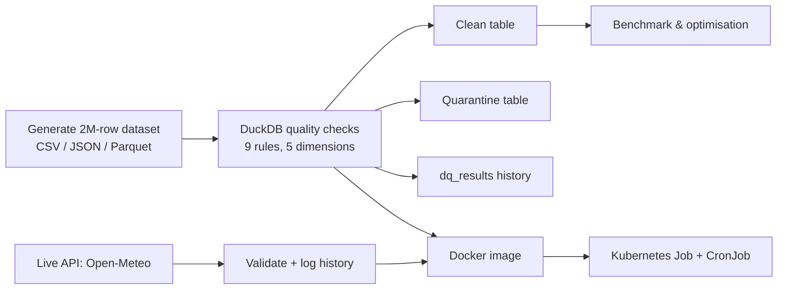

# Data Quality Monitoring using DuckDB

ISE-2 Unit 6 Practical Case Study

## Problem
Bad data (nulls, duplicates, invalid values) breaks analytics. This project builds an automated data quality monitor with DuckDB that detects defects, cleans the data, quarantines bad rows, and logs quality metrics over time.

## Note on "distributed processing"
DuckDB is a single-machine engine. It parallelises work across CPU threads and partitioned Parquet files rather than across a cluster. Kubernetes is run on a single-node minikube cluster to show the deployment workflow.

## Architecture


## Setup
```bash
python -m venv .venv
.venv\Scripts\Activate.ps1
pip install -r requirements.txt
```

## How to run (in order)
| Step | Command | What it does |
|---|---|---|
| 1 | `python src/01_generate_data.py` | Creates 2M-row dataset with injected defects |
| 2 | `python src/03_quality_checks.py` | Runs checks, cleans, quarantines, exports |
| 3 | `python src/04_optimize_benchmark.py` | Benchmarks formats, partitioning, threads, caching |
| 4 | `python src/05_realtime_api.py 4 30` | Bonus: live API monitoring |
| 5 | `docker build -t dq-duckdb:1.0 .` then `kubectl apply -f k8s/job.yaml` | Bonus: Kubernetes |
| 6 | `python src/06_compare_modes.py` | Bonus: performance comparison |

## Results
- Raw rows: 2,020,000 | Clean: 1,566,139 | Quarantined: 438,316
- Parquet was about 17x faster than CSV; in-memory caching removed CSV parsing cost
- Kubernetes Job: 1 thread/CPU 64s, 2 threads/CPU 69s (cold start), 4 threads/CPU 34s
- Modes: DuckDB 8 threads 0.047s, DuckDB 1 thread 0.101s, pandas 0.390s

## Screenshots
See the `screenshots/` folder (numbered in run order).

## Bonus criteria covered
1. Real-time API data (Open-Meteo, polled and logged)
2. Kubernetes deployment (Job and CronJob)
3. Performance comparison across execution modes
(PySpark comparison skipped: not installed)

## Conclusion
This project showed that automated data quality checks can catch and quarantine about 21.7% of a 2-million-row dataset (nulls, duplicates, invalid values) before it reaches analytics. DuckDB handled this on a single machine, and switching from CSV to Parquet made queries about 17x faster, while extra threads cut runtime further. Running the pipeline as a Kubernetes Job and CronJob showed how the same monitoring can be containerised and scheduled, even though DuckDB scales across CPU threads rather than across a cluster.